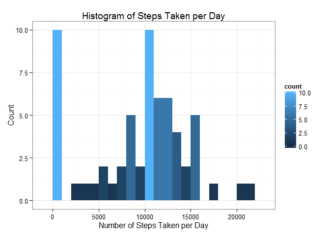
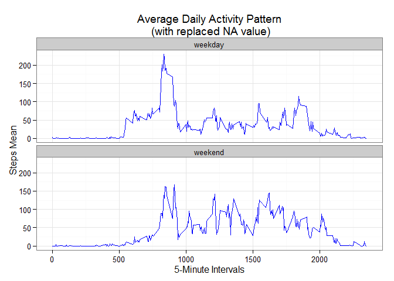

# Reproducible Research: Peer Assessment 1


# **Prepare the R environment**

Throughout this report when writing code chunks in the R markdown document, always use echo = TRUE so that someone else will be able to read the code.

Set the echo equal to TRUE as global options for this document. 

```r
library(knitr)
```

```
## Warning: package 'knitr' was built under R version 3.2.2
```

```r
opts_chunk$set(echo = TRUE, warning = FALSE)
```

 
# **Loading and Preprocessing the Data**


```r
# Clear the workspace
rm(list=ls())

# Load the necessary library
library(ggplot2)

# Unzip the activity dataset
if(!file.exists('activity.csv')){
    unzip('activity.zip')
}

# Load the activity dataset
activityData <- read.csv('activity.csv', stringsAsFactors=FALSE)

# Transform the date attribute to an actual date format
activityData$date <- as.Date(activityData$date, format="%Y-%m-%d")

# Check the data structure
str(activityData)
```

```
## 'data.frame':	17568 obs. of  3 variables:
##  $ steps   : int  NA NA NA NA NA NA NA NA NA NA ...
##  $ date    : Date, format: "2012-10-01" "2012-10-01" ...
##  $ interval: int  0 5 10 15 20 25 30 35 40 45 ...
```

  


## **What is mean total number of steps taken per day?**
 
### *1. Compute total number of steps taken per day (NA values removed)*

```r
stepsPerDay <- aggregate(activityData$steps, list(date=activityData$date), sum, na.rm=TRUE)
names(stepsPerDay)[2] <- "steps"

# Check the dataset
head(stepsPerDay)
```

```
##         date steps
## 1 2012-10-01     0
## 2 2012-10-02   126
## 3 2012-10-03 11352
## 4 2012-10-04 12116
## 5 2012-10-05 13294
## 6 2012-10-06 15420
```
 
### *2. Plot a histogram of total number of steps taken per day*

```r
ggplot(data=stepsPerDay, aes(stepsPerDay$steps)) + geom_histogram(aes(fill=..count..), binwidth = 1000) + labs(title = "Histogram of Steps Taken per Day", x = "Number of Steps Taken per Day", y = "Count") + theme_bw() 
```

 
 
### *3. Calculate and report the mean and median for total number of steps taken per day*

```r
stepsPerDayMean <- mean(stepsPerDay$steps)
stepsPerDayMedian <- median(stepsPerDay$steps)
```
 
- The **Mean** = 9354 
- The **Median** = 10395

  
  
# **What is the average daily activity pattern?**

### *1. Compute number of steps by intervals of 5-minutes*

```r
stepsMeanPerInterval <- aggregate(activityData$steps, list(interval=activityData$interval), mean, na.rm=TRUE)
names(stepsMeanPerInterval)[2] <- "stepsmean"

# Check the dataset
head(stepsMeanPerInterval)
```

```
##   interval stepsmean
## 1        0 1.7169811
## 2        5 0.3396226
## 3       10 0.1320755
## 4       15 0.1509434
## 5       20 0.0754717
## 6       25 2.0943396
```

### *2. Plot the time series of the average number of steps taken (averaged across all days) versus the 5-minute intervals*

```r
ggplot(stepsMeanPerInterval, aes(x=interval, y=stepsmean)) + geom_line(color="blue") + labs(title="Average Daily Activity Pattern", x="5-Minute Intervals", y=" Steps Mean") +  theme_bw()
```

 

### *3. Calculate the 5-minute interval with the containing the maximum number of steps*

```r
maxStepsInterval <- stepsMeanPerInterval[which.max(stepsMeanPerInterval$stepsmean),]
```

The max steps is **206** at the **835**th interval.

  

## **Imputing missing values**

### *1. Total number of missing values*

```r
missingValue <- sum(is.na(activityData$steps))
```

The total number of missing values are **2304**.


### *2. Strategy for filling in all of the missing values in the dataset*

```r
# merge activity dataset with steps mean by interval dataset 
activityData <- merge(activityData, stepsMeanPerInterval, by="interval")

# fill in missing value (NA) with a value of steps mean per interval 
for (i in 1:nrow(activityData)) {
  
  if(is.na(activityData$steps[i])){
     
    activityData$steps[i] <- activityData$stepsmean[i]}
    
  }

# Check whether there are still NA 
summary(activityData)
```

```
##     interval          steps             date              stepsmean      
##  Min.   :   0.0   Min.   :  0.00   Min.   :2012-10-01   Min.   :  0.000  
##  1st Qu.: 588.8   1st Qu.:  0.00   1st Qu.:2012-10-16   1st Qu.:  2.486  
##  Median :1177.5   Median :  0.00   Median :2012-10-31   Median : 34.113  
##  Mean   :1177.5   Mean   : 37.38   Mean   :2012-10-31   Mean   : 37.383  
##  3rd Qu.:1766.2   3rd Qu.: 27.00   3rd Qu.:2012-11-15   3rd Qu.: 52.835  
##  Max.   :2355.0   Max.   :806.00   Max.   :2012-11-30   Max.   :206.170
```

```r
head(activityData)
```

```
##   interval    steps       date stepsmean
## 1        0 1.716981 2012-10-01  1.716981
## 2        0 0.000000 2012-11-23  1.716981
## 3        0 0.000000 2012-10-28  1.716981
## 4        0 0.000000 2012-11-06  1.716981
## 5        0 0.000000 2012-11-24  1.716981
## 6        0 0.000000 2012-11-15  1.716981
```

### *3. Compute total number of steps taken per day (NA value were replaced with the value of Steps Mean per interval)*

```r
stepsPerDay <- aggregate(activityData$steps, list(date=activityData$date), sum)
names(stepsPerDay)[2] <- "steps"

# Check the dataset
head(stepsPerDay)
```

```
##         date    steps
## 1 2012-10-01 10766.19
## 2 2012-10-02   126.00
## 3 2012-10-03 11352.00
## 4 2012-10-04 12116.00
## 5 2012-10-05 13294.00
## 6 2012-10-06 15420.00
```
 
### *4. Plot a histogram of total number of steps taken per day*

```r
ggplot(data=stepsPerDay, aes(stepsPerDay$steps)) + geom_histogram(aes(fill=..count..), binwidth = 1000) + labs(title = "Histogram of Steps Taken per Day\n (with replaced NA value)", x = "Number of Steps Taken per Day", y = "Count") + theme_bw() 
```

 

Compute the mean and median

```r
stepsPerDayMean <- mean(stepsPerDay$steps)
stepsPerDayMedian <- median(stepsPerDay$steps)
```
 
The strategy filling in NA value with steps mean per interval gives a mean and median of **10766** and **10766** respectively.

These values differ from the first part of the assignment. The impact of imputing the missing values is to have similar mean and median value.


## **Are there differences in activity patterns between weekdays and weekends?**

### *1. Compute the weekday and weekend*

```r
# Compute the weekdays from the date attribute
activityData$weekday <- weekdays(activityData$date)

# Compute the day type (weekend or weekday)
activityData$daytype <- ifelse(activityData$weekday == "Saturday" | activityData$weekday == "Sunday", "weekend", "weekday")

# Check the dataset
head(activityData)
```

```
##   interval    steps       date stepsmean  weekday daytype
## 1        0 1.716981 2012-10-01  1.716981   Monday weekday
## 2        0 0.000000 2012-11-23  1.716981   Friday weekday
## 3        0 0.000000 2012-10-28  1.716981   Sunday weekend
## 4        0 0.000000 2012-11-06  1.716981  Tuesday weekday
## 5        0 0.000000 2012-11-24  1.716981 Saturday weekend
## 6        0 0.000000 2012-11-15  1.716981 Thursday weekday
```

### *2. Compute number of steps by intervals of 5-minutes*

```r
stepsMeanPerInterval <- aggregate(activityData$steps, list(interval=activityData$interval, daytype=activityData$daytype), mean)
names(stepsMeanPerInterval)[3] <- "stepsmean"

# Check the dataset
head(stepsMeanPerInterval)
```

```
##   interval daytype  stepsmean
## 1        0 weekday 2.25115304
## 2        5 weekday 0.44528302
## 3       10 weekday 0.17316562
## 4       15 weekday 0.19790356
## 5       20 weekday 0.09895178
## 6       25 weekday 1.59035639
```


### *3. Plot the time series of the average number of steps taken (averaged across all days) versus the 5-minute intervals*

```r
ggplot(stepsMeanPerInterval, aes(x=interval, y=stepsmean)) + geom_line(color="blue") + labs(title="Average Daily Activity Pattern\n (with replaced NA value)", x="5-Minute Intervals", y="Steps Mean") + facet_wrap(~daytype, ncol=1) + theme_bw()
```

 

The steps taken during the weekend is slightly higher than weekday but both weekday and weekend activity start and finish more or less at similar time.
